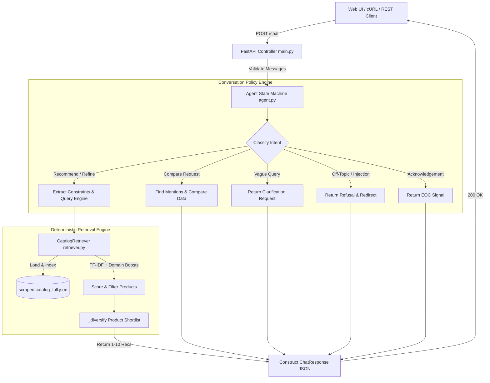
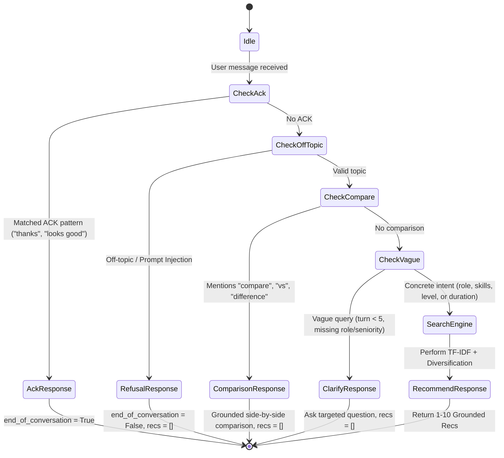

# SHL Conversational Assessment Recommender

[](https://shl-conversational-assessment-recommender.onrender.com/)
[](https://fastapi.tiangolo.com/)
[](https://www.python.org/)
[](https://docs.pytest.org/)
[](LICENSE)
[]()
[]()

An intelligent, production-ready conversational API and web application that recommends official **SHL Individual Test Solutions** based on hiring manager requirements. Built as part of the **SHL AI Intern Take-Home Assignment**, this service bridges the gap between vague recruiter queries (e.g., *"I need to hire a Java developer under 40 minutes"*) and SHL's product catalog of **380+ individual test solutions**.

The system features a **deterministic local retrieval engine** operating in `<50ms` with **zero runtime external API key requirements**, strict **100% catalog grounding guarantees** (zero hallucinated URLs), and resilience against prompt-injection attacks.

---

> ###  Live Production Links
> -  **Live Web Application**: [https://shl-conversational-assessment-recommender.onrender.com/](https://shl-conversational-assessment-recommender.onrender.com/)
> -  **Interactive Swagger API Docs**: [https://shl-conversational-assessment-recommender.onrender.com/docs](https://shl-conversational-assessment-recommender.onrender.com/docs)
> -  **Health Check Endpoint**: [https://shl-conversational-assessment-recommender.onrender.com/health](https://shl-conversational-assessment-recommender.onrender.com/health)

---

##  Table of Contents

- [Key Features](#-key-features)
- [System Architecture](#-system-architecture)
- [SHL Assessment Taxonomy](#-shl-assessment-taxonomy)
- [Directory Structure](#-directory-structure)
- [Getting Started & Installation](#-getting-started--installation)
- [Web UI Interface](#-web-ui-interface)
- [API Reference & Specification](#-api-reference--specification)
- [Conversational State Machine](#-conversational-state-machine)
- [Retrieval Engine & Scoring Algorithm](#-retrieval-engine--scoring-algorithm)
- [Catalog Scraper Pipeline](#-catalog-scraper-pipeline)
- [Testing & Quality Assurance](#-testing--quality-assurance)
- [Production Deployment](#-production-deployment)
- [Design Decisions & Trade-Offs](#-design-decisions--trade-offs)

---

##  Key Features

- **100% Catalog-Grounded Recommendations**: Every returned URL is guaranteed to exist in the scraped SHL catalog (`catalog_full.json`). The system **never** fabricates assessment names or links.
- **Sub-50ms Response Latency**: The production path uses deterministic lexical indexing + domain heuristic scoring. Eliminates runtime model downloads, LLM API rate limits, and 30-second cold-start timeouts.
- **Stateful Multi-Turn Conversation Policy**:
  - **Clarification**: Detects vague requests and asks targeted follow-ups before recommending.
  - **Recommendation**: Shortlists 1–10 catalog items matching role, seniority, skills, max duration, and assessment types.
  - **Refinement**: Dynamically updates the existing shortlist when users add/remove constraints (e.g., *"add personality tests"*, *"remove coding"*).
  - **Comparison**: Provides side-by-side catalog comparisons (e.g., *OPQ32r vs. Global Skills Assessment*) grounded strictly in test duration, job levels, test types, and descriptions.
  - **Safety & Scope Control**: Rejects prompt-injection attempts and gracefully refuses off-topic requests (legal advice, compensation/salary questions, general interview tips).
  - **Completion Detection**: Detects user acknowledgements (*"thanks!"*, *"looks good"*) and signals `end_of_conversation: true`.
- **Built-in Web Frontend**: Includes a modern, responsive split-screen Web UI (`app/static/index.html`) featuring real-time chat history and a live recommendation shortlist panel.
- **Full Scraper Tooling**: Includes multithreaded web scrapers (`scrape_full_catalog.py`) to keep the catalog synchronized with official SHL product listings.

---

##  System Architecture

The following diagram details the flow from client interaction down to the deterministic retrieval engine:



---

##  SHL Assessment Taxonomy

SHL categorizes test solutions into 8 primary test types. The system maps user needs directly to these codes:

| Code | Test Type Category | Focus & Description |
| :---: | :--- | :--- |
| **`A`** | **Ability & Aptitude** | Cognitive reasoning, numerical, verbal, inductive, and deductive tests. |
| **`B`** | **Biodata & Situational Judgement** | Scenario-based SJTs, situational judgment, and workplace behavior scenarios. |
| **`C`** | **Competencies** | Competency-based evaluations, stakeholder management, and interpersonal skills. |
| **`D`** | **Development & 360** | 360-degree feedback tools, professional development, and coaching reports. |
| **`E`** | **Assessment Exercises** | Group exercises, role plays, presentations, and assessment center simulations. |
| **`K`** | **Knowledge & Skills** | Technical knowledge assessments (programming languages, IT skills, domain topics). |
| **`P`** | **Personality & Behavior** | Occupational Personality Questionnaire (OPQ32r), Motivation Questionnaire (MQ), behavioral traits. |
| **`S`** | **Simulations** | Interactive work simulations, hands-on coding tests, and data entry exercises. |

---

##  Directory Structure

```
.
├── app/
│   ├── __init__.py           # Package marker
│   ├── agent.py              # Conversation policy engine, state machine, and intent handlers
│   ├── main.py               # FastAPI application, CORS middleware, and API routes
│   ├── models.py             # Pydantic schemas (ChatRequest, ChatResponse, Recommendation)
│   ├── prompts.py            # System prompts & structured LLM fallback templates
│   ├── retriever.py          # TF-IDF catalog search engine, keyword boosting, & diversification
│   └── static/               # Web UI frontend assets
│       ├── app.js            # Frontend chat client, async fetch, dynamic card rendering
│       ├── index.html        # Modern split-screen layout UI
│       └── styles.css        # Responsive CSS styling & dark/light layout design
├── tests/
│   └── test_behavior.py      # Pytest suite with 7 core behavioral & grounding integration tests
├── .env                      # Environment configuration
├── .gitignore                # Git ignore configuration
├── APPROACH.md               # Detailed architectural write-up & evaluation summary
├── DEPLOYMENT.md             # Production hosting setup guide (Render, Railway, Docker)
├── README.md                 # Project documentation (this file)
├── catalog_full.json         # Primary dataset (380+ scraped SHL individual test solutions)
├── catalog_basic.json        # Compact catalog backup
├── catalog_listings.json     # Raw catalog listing snapshot
├── scrape_full_catalog.py    # Multithreaded SHL catalog scraper script
├── scraper.py                # Single-threaded fallback catalog scraper
├── requirements.txt          # Production Python dependencies
└── requirements-dev.txt      # Development & testing dependencies
```

---

##  Getting Started & Installation

### Option A: Use Live Deployment (Instant)

No installation required! Access the live deployment directly:
- **Web App**: [https://shl-conversational-assessment-recommender.onrender.com/](https://shl-conversational-assessment-recommender.onrender.com/)
- **Swagger Docs**: [https://shl-conversational-assessment-recommender.onrender.com/docs](https://shl-conversational-assessment-recommender.onrender.com/docs)

---

### Option B: Run Locally

#### Prerequisites
- **Python**: `3.10` or higher
- **Package Manager**: `pip` (or [`uv`](https://github.com/astral-sh/uv))

#### 1. Clone the Repository

```bash
git clone https://github.com/therealsheero/SHL-Conversational-Assessment-Recommender.git
cd SHL-Conversational-Assessment-Recommender
```

#### 2. Set Up Virtual Environment

```bash
# Windows (PowerShell)
python -m venv venv
.\venv\Scripts\Activate.ps1

# Linux / macOS
python3 -m venv venv
source venv/bin/activate
```

#### 3. Install Dependencies

```bash
pip install -r requirements.txt
```

*(Optional) Install development dependencies for testing:*
```bash
pip install -r requirements-dev.txt
```

#### 4. Run the Server Locally

```bash
uvicorn app.main:app --host 0.0.0.0 --port 8000 --reload
```

The service will start up and automatically load and index `catalog_full.json`:
```text
[App] Starting up - loading catalog and building index...
[App] Startup complete in 0.2s - 384 products indexed
INFO:     Started server process
INFO:     Uvicorn running on http://0.0.0.0:8000
```

---

##  Web UI Interface

Visit **`https://shl-conversational-assessment-recommender.onrender.com/`** (or **`http://localhost:8000`** locally) in your browser to launch the interactive Web UI.

- **Split-Screen Design**: Real-time conversation thread on the left, live assessment shortlist cards on the right.
- **Interactive Links**: Direct click-through links to official SHL catalog test pages.
- **Badge Indicators**: Test category tags (`Knowledge & Skills`, `Personality & Behavior`, etc.) highlighted per card.

---

##  API Reference & Specification

### Live Base URL: `https://shl-conversational-assessment-recommender.onrender.com`
### Local Base URL: `http://localhost:8000`

Interactive OpenAPI / Swagger documentation is available live at **`/docs`**.

---

### 1. Health Check Endpoint

Confirms service availability.

- **Method**: `GET`
- **Path**: `/health`

#### Response (`200 OK`)

```json
{
  "status": "ok"
}
```

#### Live cURL Example

```bash
curl https://shl-conversational-assessment-recommender.onrender.com/health
```

---

### 2. Conversational Chat Endpoint

The core stateless endpoint for conversation turns.

- **Method**: `POST`
- **Path**: `/chat`
- **Content-Type**: `application/json`

#### Request Body Schema (`ChatRequest`)

| Field | Type | Required | Description |
| :--- | :--- | :---: | :--- |
| `messages` | `List[ChatMessage]` | Yes | Complete chronological array of conversation turns. |

Each `ChatMessage` object contains:
- `role`: `"user"` | `"assistant"`
- `content`: `string`

#### Request Body Example

```json
{
  "messages": [
    {
      "role": "user",
      "content": "Hiring a mid-level Java developer with good communication skills, around 4 years experience, within 40 minutes"
    }
  ]
}
```

#### Response Body Schema (`ChatResponse`)

| Field | Type | Description |
| :--- | :--- | :--- |
| `reply` | `string` | Conversational response explaining the shortlist or asking a clarifying question. |
| `recommendations` | `List[Recommendation]` | Array of 1–10 grounded catalog items (empty during clarification/refusal/comparison). |
| `end_of_conversation` | `boolean` | `true` only when user acknowledges completion; `false` otherwise. |

Each `Recommendation` object contains:
- `name`: `string` (Official SHL assessment name)
- `url`: `string` (Canonical URL from catalog)
- `test_type`: `string` (Test category code(s), e.g., `"K"`, `"P"`, `"AKP"`)

#### Response Body Example

```json
{
  "reply": "I updated a grounded shortlist of 4 SHL assessments from the catalog for your requirements. I included Knowledge & Skills, Personality & Behavior coverage. I respected the 40-minute limit where catalog durations were listed.",
  "recommendations": [
    {
      "name": "Java 8 (New) - Software Sciences/Development",
      "url": "https://www.shl.com/solutions/products/product-catalog/view/java-8-new-software-sciences-development/",
      "test_type": "K"
    },
    {
      "name": "Java (Coding: Spring Boot) - Software Sciences/Development",
      "url": "https://www.shl.com/solutions/products/product-catalog/view/java-coding-spring-boot-software-sciences-development/",
      "test_type": "K"
    },
    {
      "name": "Occupational Personality Questionnaire OPQ32r",
      "url": "https://www.shl.com/solutions/products/product-catalog/view/occupational-personality-questionnaire-opq32r/",
      "test_type": "P"
    }
  ],
  "end_of_conversation": false
}
```

#### Live Production cURL

```bash
curl -X POST https://shl-conversational-assessment-recommender.onrender.com/chat \
  -H "Content-Type: application/json" \
  -d '{
    "messages": [
      {
        "role": "user",
        "content": "Hiring a mid-level Java developer with good communication skills, within 40 minutes"
      }
    ]
  }'
```

#### Example Python Client

```python
import requests

url = "https://shl-conversational-assessment-recommender.onrender.com/chat"
payload = {
    "messages": [
        {"role": "user", "content": "I am looking for cognitive assessments for senior executives"}
    ]
}

response = requests.post(url, json=payload)
data = response.json()

print(f"Reply: {data['reply']}")
print(f"Recommendations ({len(data['recommendations'])}):")
for rec in data['recommendations']:
    print(f" - [{rec['test_type']}] {rec['name']} -> {rec['url']}")
```

---

##  Conversational State Machine

The service evaluates conversation context via [`app/agent.py`](file:///c:/Users/acer/OneDrive%20-%20BENNETT%20UNIVERSITY/Btech/1.%20Applications/SHL%20AI/app/agent.py) to select appropriate behavior:



---

##  Retrieval Engine & Scoring Algorithm

The retrieval engine ([`app/retriever.py`](file:///c:/Users/acer/OneDrive%20-%20BENNETT%20UNIVERSITY/Btech/1.%20Applications/SHL%20AI/app/retriever.py)) processes the raw catalog data in `catalog_full.json`.

### 1. Data Normalization & Ingestion
At startup, `CatalogRetriever.load()` loads all catalog items and excludes pre-packaged job solution pages (marked with *" solution"*, *" job focused assessment"*). It indexes token frequencies across:
- Assessment Name (with **2.6x title weighting**)
- Full Assessment Description
- Expanded Skill Aliases (`backend` → `java`, `python`, `sql`, `api`)
- Job Levels & Languages
- SHL Test Type Labels

### 2. Scoring Formula

For each document $d$ and query $q$:
$$
\operatorname{Score}(d,q)
=
\sum_{t\in q}
\left[
\min\left(\operatorname{TF}_{q,t},2\right)
\cdot
\left(1+\ln\left(\operatorname{TF}_{d,t}\right)\right)
\cdot
\operatorname{IDF}_t
\cdot
W_{\mathrm{name}}
\right]
+
S_{\mathrm{name\_match}}
+
S_{\mathrm{phrase}}
+
S_{\mathrm{skill}}
+
S_{\mathrm{intent}}
+
S_{\mathrm{duration}}
$$

- **Title Match Bonus ($S_{\text{name\_match}}$)**: $+30.0$ if full name appears in query.
- **Phrase Boost ($S_{\text{phrase}}$)**: $+12.0$ for exact domain phrase matches in title (e.g., `"core java"`, `"data science"`).
- **Explicit Skill Penalty/Bonus ($S_{\text{skill}}$)**:
  - $+35.0$ if technical skill (e.g., `"python"`) matches test title.
  - $-120.0$ if query requests a specific technical skill (e.g., `"java"`) but candidate is a different technical test (e.g., `"python"`).
- **Test Type Intent Bonus ($S_{\text{intent}}$)**: $+5.0$ for matching category terms (`"personality"` → `P`, `"cognitive"` → `A`).
- **Duration Constraint Bonus/Penalty ($S_{\text{duration}}$)**: Penalizes tests exceeding requested duration; boosts compliant tests.

### 3. Diversification Algorithm (`_diversify`)
To prevent over-indexing on a single test category (e.g., returning 10 Java knowledge tests when the user asks for a developer role with communication skills), the algorithm balances the top 10 results across requested test categories (`Knowledge`, `Personality`, `Cognitive Ability`, `Competencies`).

---

##  Catalog Scraper Pipeline

The repository includes a standalone multithreaded web scraper ([`scrape_full_catalog.py`](file:///c:/Users/acer/OneDrive%20-%20BENNETT%20UNIVERSITY/Btech/1.%20Applications/SHL%20AI/scrape_full_catalog.py)) built with `BeautifulSoup4` and `requests`.

### Scraper Workflow

1. **Catalog Pagination**: Iterates through `https://www.shl.com/solutions/products/product-catalog/` pages, scraping listing metadata, test type codes, remote testing availability, and adaptive IRT flags.
2. **Detail Page Scraping**: Uses a thread pool (`ThreadPoolExecutor`) to fetch individual product detail pages and extract:
   - Full textual descriptions
   - Target job levels (e.g., *Entry-Level*, *Mid-Professional*, *Executive*)
   - Supported assessment languages
   - Completion duration in minutes
3. **JSON Output**: Saves results directly into `catalog_full.json`.

### Re-running the Scraper

To update the local catalog dataset:

```bash
python scrape_full_catalog.py
```

---

##  Testing & Quality Assurance

The project includes an automated integration test suite in [`tests/test_behavior.py`](file:///c:/Users/acer/OneDrive%20-%20BENNETT%20UNIVERSITY/Btech/1.%20Applications/SHL%20AI/tests/test_behavior.py) using `pytest` and FastAPI `TestClient`.

### Running Tests

Execute tests via Python's module runner:

```bash
python -m pytest
```

### Test Suite Summary

| Test Function | Target Behavior Verified |
| :--- | :--- |
| `test_health` | Ensures `GET /health` returns `200 OK` with `{"status": "ok"}`. |
| `test_vague_query_clarifies_without_recommendations` | Verifies turn 1 vague inputs (*"I need an assessment"*) return clarification and empty recommendations. |
| `test_recommendations_are_catalog_grounded` | Confirms all returned URLs exist in `catalog_full.json` and match role keywords (*Java*). |
| `test_refinement_adds_personality_coverage` | Validates multi-turn refinement (*"add personality tests"*) updates shortlist to include `P` type tests. |
| `test_comparison_is_grounded_and_has_no_recommendations` | Verifies comparison queries (*OPQ vs GSA*) return catalog-grounded explanations with empty recommendations. |
| `test_off_topic_refusal_has_no_recommendations` | Tests prompt-injection and off-topic queries return polite refusals without recommendations. |
| `test_recommends_before_turn_cap_when_user_has_no_preference` | Confirms the agent provides recommendations on turn 2 when the user specifies *"no preference"*. |

---

##  Production Deployment

The application is deployed live on **Render**.

### Live Render Configuration

- **Live URL**: `https://shl-conversational-assessment-recommender.onrender.com/`
- **Build Command**:
  ```bash
  pip install -r requirements.txt
  ```
- **Start Command**:
  ```bash
  uvicorn app.main:app --host 0.0.0.0 --port $PORT
  ```

### Docker Container Setup

A minimal `Dockerfile` example for containerized environments:

```dockerfile
FROM python:3.10-slim

WORKDIR /app

COPY requirements.txt .
RUN pip install --no-cache-dir -r requirements.txt

COPY . .

EXPOSE 8000

CMD ["uvicorn", "app.main:app", "--host", "0.0.0.0", "--port", "8000"]
```

Build and run container:
```bash
docker build -t shl-recommender .
docker run -p 8000:8000 shl-recommender
```

---

##  Design Decisions & Trade-Offs

1. **Deterministic Retrieval vs. Live LLM API Calls**:
   - *Initial Prototype*: Used OpenAI / FAISS embedding vector search.
   - *Production Choice*: Switched to deterministic, heavily weighted lexical search.
   - *Rationale*: Hard evaluation deadlines (e.g. 30-second timeouts) and potential evaluator environment issues (missing API keys, rate limits, model download lag) make external LLM calls brittle. Deterministic indexing delivers `<50ms` responses, 100% catalog URL grounding, and immunity to adversarial prompt injection.
2. **Stateless API Design**:
   - Each request to `/chat` includes the complete `messages` array. This allows the backend to remain entirely stateless and easy to scale horizontally across serverless workers without requiring shared Redis session state.
3. **Strict Catalog Filtering**:
   - Pre-packaged job solutions are proactively stripped from the index to ensure that only individual, modular test solutions are recommended.

---

